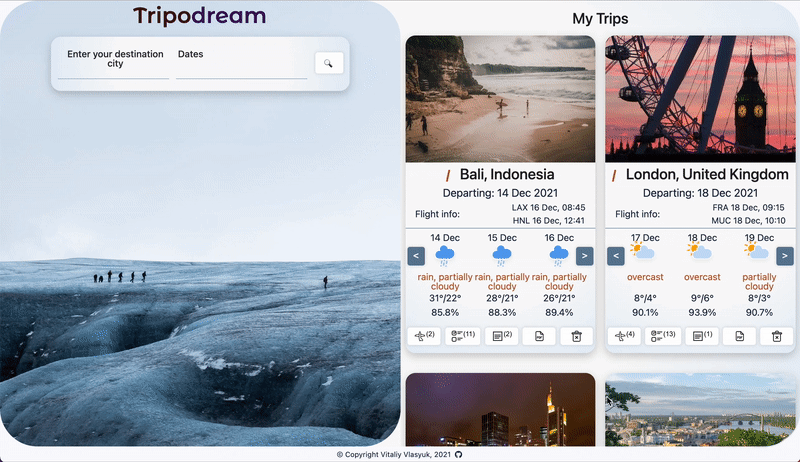

<h1 align="center">
<br>
  <a href="https://tripodream.herokuapp.com/"></a>
  <br>
  Tripodream
  <br>
</h1>

 <p align="center">
   <a href="#deployed-version">Demo</a> •
   <a href="#description">Description</a> •
   <a href="#key-features">Key Features</a> •
   <a href="#demonstration">Demonstration</a> •
   <a href="#technologies-used">Technologies Used</a> •
   <a href="#getting-started">Getting Started</a> •
   <a href="#testing">Testing</a> •
   <a href="#error-handling">Error Handling</a>

</p>

## Deployed Version

For live demo please visit 👉 https://tripodream.herokuapp.com/

## Description

TRIPODREAM is a single-page web application that allows users to perform trip planning. The app obtains a desired trip location & date from the user and displays weather forecast or predictions and an image of the location using information obtained from external APIs. Users can add flights, packing list and notes for the upcoming trip. All information is stored in local storage so that when they close, then revisit the page, their information is still there. Users can edit they trips and export them to PDF.

This project was final capstone project for Udacity Frontend Web Developer Nanodegree which I graduated from on December 14, 2021.


## Key Features

- Add new trip
  - Display forecasted or predicted weather from VisualCrossing API
  - Incorporate icons into forecast
  - Display image of the location (or the country) from Pixabay API
  - Display trip countdown
- Add additional information for the trip
  - Multiple flights, for each flight extra data is pulled from Amadeus API
  - Todo list/packing list
  - Notes
- Multiple trips
  - Use Local Storage to save the data
  - Automatically sort additional trips by countdown
  - Next upcoming flight is displayed
  - Move expired trips to bottom and have them greyed out
  - Allow the user to remove the trip
- Export
  - Allow user to export they trip to PDF
- Travel inspirations
  - Tag cloud with random destinations is displayed, onclick this destination is added to the search form

## Demonstration

#### Home Page :


#### Add new trip:


#### Edit saved trips :


#### Print pdf :



## Technologies Used

- JavaScript
- [Node.js](https://nodejs.org/) / [Express.js](https://expressjs.com/)
- HTML / [SASS](https://sass-lang.com/)
- [Webpack](https://github.com/webpack/webpack)
- [axios](https://www.npmjs.com/package/axios)
- [jsPDF](https://github.com/parallax/jsPDF)
- [TagCloud](https://github.com/cong-min/TagCloud)
- [Amadeus API](https://developers.amadeus.com/)
- [Geonames API](http://www.geonames.org/export/web-services.html)
- [Pixabay API](https://pixabay.com/api/docs/)
- [VisualCrossing API](https://www.visualcrossing.com/weather-api)
- [Workbox](https://developers.google.com/web/tools/workbox)
- [Jest](https://github.com/facebook/jest)

## Getting Started

### Prerequisites

Make sure Node and npm are installed from the terminal

```bash
$ node -v
$ npm -v
```

---

### Installation

1. Fork this repo, then clone the app down to your computer:

   ```bash
   $ git clone  https://github.com/hkzone/Tripodream.git
   ```

2. `cd` into your new folder and install all the
   dependencies by running:

   ```bash
   $ npm i
   ```

3. Sign up for API keys with:

- [Amadeus API](https://developers.amadeus.com/)
- [Geonames API](http://www.geonames.org/export/web-services.html)
- [Pixabay API](https://pixabay.com/api/docs/)
- [VisualCrossing API](https://www.visualcrossing.com/weather-api)
  <br>

4. Configure environment variables by creating new `.env` file in the root of your project. Fill the file with variables as bellow:

   ```bash
   PORT=3000
   AmadeusAPIKey=*******************************
   AmadeusAPISecret=****************************
   apiKeyGeonames=******************************
   apiKeyPixabay=*******************************
   apiKeyVisualCrossing=************************
   ```

5. Run the app in development mode at http://localhost:8081/, in production mode at http://localhost:8080/

   |       Command        |         Action         |
   | :------------------: | :--------------------: |
   | `npm run build-prod` |     Build project      |
   |     `npm start`      |      Run project       |
   |    `npm run dev`     | Run webpack dev server |

---

## Testing

Testing is done with [Jest](https://github.com/facebook/jest). This project has a Testing Units that can be found at `__test__` folder in the root directory.
To run tests you can use the following NPM command:

```
$ npm run test
```

---

## Error handling

- User will be informed about uncomplete data for the search.
- There will be notification with description for all errors returned by APIs.
- If no images are found for user-entered city by Pixabay, image of country will be used instead.
- There will be notification for any other errors.
